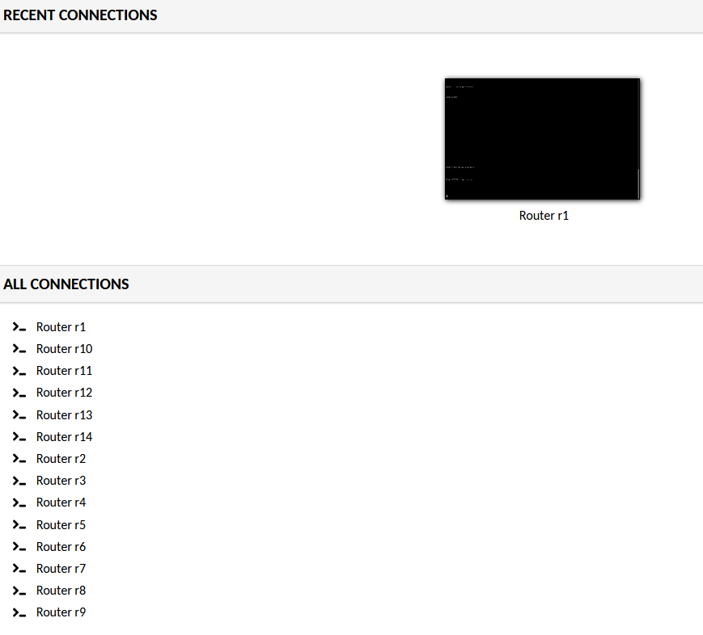
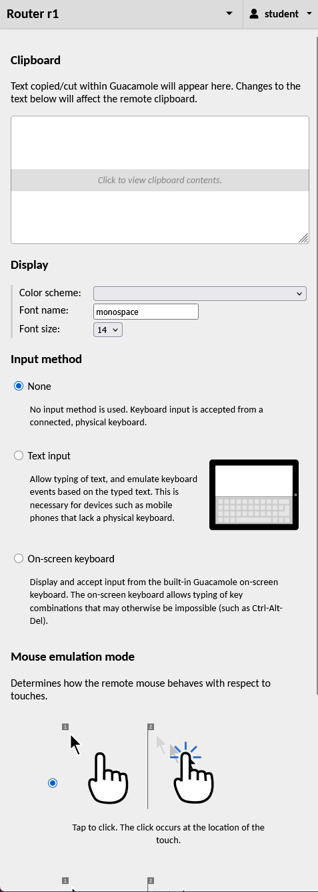

# Using Apache Guacamole to Access Workshop Lab Routers

This guide explains how students can use the Apache Guacamole web interface to access the workshop router consoles from a normal web browser.

No Telnet client, SSH client or Dynamips software is required on the student's computer. The workshop server provides the router console through Guacamole.

> **Note:** The exact web address, username and password will be provided by the workshop instructor.

## 1. Open the workshop web page

Open the workshop Guacamole address supplied by the instructor in a modern web browser.

The workshop server may use a self-signed HTTPS certificate. If so, the browser may display a certificate warning. Follow the instructor's directions before continuing.

Log in using the workshop username and password provided by the instructor.

## 2. Select a router

After logging in, Guacamole displays the **Home** screen.

The **All Connections** section lists the routers that are available to you.



Select the router assigned to you, for example:

```text
Router r1
```

Guacamole opens the router console in the browser.

If the console initially appears blank, click inside the terminal and press **Enter** once.

## 3. Use the router console

Once connected, the browser window acts as the router's console terminal.

You can type Cisco IOS commands normally, for example:

```text
enable
show ip interface brief
show ip route
show running-config
```

Your keyboard input is sent directly to the router console.

The router continues running on the workshop server even if you leave the Guacamole connection.

## 4. Open the Guacamole menu

While the router console is open, most Guacamole controls are hidden.

On a desktop or laptop keyboard, press:

```text
Ctrl + Alt + Shift
```

This opens the Guacamole menu.

Press the same key combination again to close the menu.

On a touchscreen device, Guacamole also supports opening the menu by swiping right from the left edge of the screen.



The menu contains options for the clipboard, display settings, keyboard input and navigation.

## 5. Return to the Home screen

To return to the list of routers:

1. Press **Ctrl + Alt + Shift** to open the Guacamole menu.
2. Select the username menu in the upper-right corner.
3. Select **Home**.

Returning to **Home** does **not** stop the router. Guacamole can keep the connection active in the background.

You can then select another router from **All Connections**.

Your browser's **Back** button can also return to the Guacamole Home screen without disconnecting the router session.

## 6. Switch directly to another router

If more than one connection is available, you can switch between active connections without returning to the Home screen.

Open the Guacamole menu with:

```text
Ctrl + Alt + Shift
```

Select the current connection name at the top of the menu, such as **Router r1**, and choose another available connection.

Guacamole can keep previous connections active while you switch between them.

For most workshop activities, returning to **Home** and choosing the required router is the simplest method.

## 7. Disconnect from a router

Returning to the Home screen and disconnecting are different actions.

If you want to explicitly close your current Guacamole connection:

1. Open the Guacamole menu with **Ctrl + Alt + Shift**.
2. Open the user menu.
3. Select **Disconnect**.

This closes only the current Guacamole connection.

It does **not** power off or stop the virtual Cisco router running on the workshop server.

## 8. Log out of the workshop

When you have finished the workshop session:

1. Open the Guacamole menu if you are currently connected to a router.
2. Select the user menu.
3. Select **Logout**.

Logging out closes your active Guacamole connections and ends your Guacamole login session.

## 9. Clipboard

The Guacamole menu contains a **Clipboard** section.

For a router console, you can use this area when you need to move text between your local computer and the browser session.

Open the menu with:

```text
Ctrl + Alt + Shift
```

The clipboard contents are hidden initially. Select **Click to view clipboard contents** if you need to view or edit them.

Clipboard behaviour can vary between browsers because browsers apply security restrictions to clipboard access.

## 10. Display and font size

The Guacamole menu contains display controls for the terminal.

For the routing lab, the most useful setting is usually **Font size**.

If the router console text is difficult to read:

1. Press **Ctrl + Alt + Shift**.
2. Find the **Display** section.
3. Increase or decrease the **Font size**.
4. Press **Ctrl + Alt + Shift** again to close the menu.

Changing the font size affects your browser display only. It does not change the Cisco router.

## 11. Mobile and touchscreen devices

Guacamole can operate from mobile and touchscreen browsers, but a laptop or desktop computer with a physical keyboard is recommended for command-line router exercises.

On a touchscreen:

- Swipe right from the left edge to open the Guacamole menu.
- Use **Text input** if the normal mobile keyboard does not work correctly.
- The **On-screen keyboard** can send keys which may otherwise be difficult to enter.

## 12. Common problems

### The router console is blank

Click inside the console and press **Enter**.

If there is still no response, wait a few seconds and try again. The router may still be starting.

### Keyboard input does not appear

Click inside the black terminal area before typing.

If you are using a mobile or touchscreen device, open the Guacamole menu and try **Text input** or the **On-screen keyboard**.

### I opened the Guacamole menu accidentally

Press:

```text
Ctrl + Alt + Shift
```

again.

### I want to return to the router list

Open the Guacamole menu and choose **Home** from the user menu.

### I closed the router connection

Return to **Home** and select the router again. Closing a Guacamole console does not normally stop the router itself.

### The browser displays a certificate warning

The workshop environment may use a self-signed HTTPS certificate. Confirm the workshop URL with the instructor before accepting any certificate warning.

### I cannot connect to my assigned router

Tell the instructor:

- which router you selected
- what message appeared in the browser
- whether other routers work
- approximately when the problem occurred

This information helps the instructor check the Guacamole and Dynamips logs.

## Quick reference

| Action | How |
| --- | --- |
| Open Guacamole menu | `Ctrl + Alt + Shift` |
| Close Guacamole menu | `Ctrl + Alt + Shift` |
| Open router console | Select the router on the Home screen |
| Wake a blank console | Click the terminal and press `Enter` |
| Return to router list | Guacamole menu → user menu → **Home** |
| Switch connection | Guacamole menu → connection name |
| Close current console | Guacamole menu → user menu → **Disconnect** |
| End Guacamole session | user menu → **Logout** |
| Touchscreen menu | Swipe right from the left edge |

## Apache Guacamole documentation

The official Apache Guacamole user guide contains additional information about the Home screen, Guacamole menu, clipboard, switching connections, display scaling and mobile input:

https://guacamole.apache.org/doc/gug/using-guacamole.html

Apache Guacamole project:

https://guacamole.apache.org/

## Workshop note

This guide describes the browser interface used by this workshop. The workshop server configuration, Dynamips topology and Guacamole administration are documented separately for instructors.
