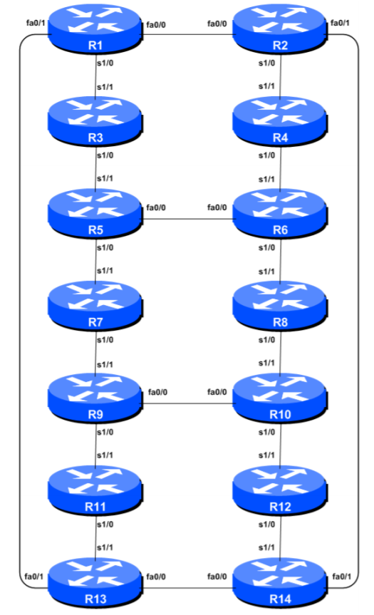

# Routing Workshop on Ubuntu 24.04 LTS

This directory updates the existing Ubuntu 18.04 Dynamips/Dynagen routing
workshop for Ubuntu 24.04 LTS while retaining the original 14-router topology
and the familiar `~/virtual_labs` layout.

The Ubuntu 18.04 version is available at:

https://github.com/waz-here/Ubuntu18.04/tree/master/workshops/routing

## Requirements

This installer is designed for **Ubuntu 24.04 LTS** and should be run with
`sudo` on a dedicated workshop VM. It is not intended as a general-purpose
production server build.

The workshop uses:

- Dynamips 0.2.24 built from the upstream GNS3 Dynamips source.
- Dynagen 0.11.0 in an isolated Python 2 compatibility container.
- Docker Engine and the Docker Compose plugin.
- Apache Guacamole 1.6.0 for browser-based router consoles.
- Nginx as the HTTPS reverse proxy.
- `screen` for keeping an interactive Dynagen session alive.
- Optional `iptables` and `ip6tables` firewall rules, persisted with
  `netfilter-persistent`.

Upstream references:

- Dynamips: https://github.com/GNS3/dynamips
- Docker on Ubuntu: https://docs.docker.com/engine/install/ubuntu/
- Apache Guacamole Docker: https://guacamole.apache.org/doc/gug/guacamole-docker.html
- Guacamole configuration: https://guacamole.apache.org/doc/gug/configuring-guacamole.html

## Cisco IOS image

The Cisco 7200 IOS image is **not included** in this repository.

The topology expects:

```text
~/virtual_labs/images/c7200-advipservicesk9-mz.152-4.S3.image
```

After installation:

```bash
ls -lh ~/virtual_labs/images/
```

The filename must match the `image` entries in `dynamips/topology.net`.
Use only an IOS image that you are legally entitled to use.

Cisco 7200 support information:

https://www.cisco.com/c/en/us/support/routers/7200-series-routers/tsd-products-support-series-home.html

## Repository layout

```text
routing-ubuntu24/
├── README.md
├── setup_routing_workshop_ubuntu24.sh
├── dynamips/
│   ├── topology.net
│   ├── start_dynamips.sh
│   ├── stop_dynamips.sh
│   ├── status_lab.sh
│   └── launch_lab.sh
├── guacamole/
│   ├── README.md
│   └── compose.yaml.example
└── images/
    └── README.md
```

The installer copies the `dynamips/` directory into:

```text
~/virtual_labs/routing/
```

If the repository folder is not available beside the installer, the installer
can fall back to downloading `topology.net` from the existing workshop
repository.


## Optional instructor jump host

The installer can create a locked-down LXC jump host for instructor access to
the router AUX consoles:

```bash
sudo ./setup_routing_workshop_ubuntu24.sh --enable-instructor-jumphost
```

The internal management network is `192.168.30.0/24`. The Ubuntu workshop host
uses `192.168.30.254` and the instructor LXC uses `192.168.30.222`.

The external port convention is:

| Port | Purpose |
| ---: | --- |
| TCP 22 | Ubuntu VM administration |
| TCP 443 | Student Guacamole access |
| TCP 2222 | Instructor SSH, forwarded to the LXC jump host |

After logging in through TCP/2222, the instructor is presented with a
router-selection menu. Router r01 maps to AUX TCP/3001 through Router r14 on
TCP/3014. The AUX ports are not exposed on the WAN.

For Azure deployments, allow TCP/2222 in the Network Security Group only from
trusted instructor source addresses. Keep TCP/22 available for VM
administration. The `192.168.30.0/24` network remains private behind the VM.

## Actions performed

The installer:

- Updates APT package lists.
- Runs `apt-get dist-upgrade -y` unless `--no-upgrade` is specified.
- Installs OpenSSH, Screen, build dependencies and networking utilities.
- Installs Docker Engine from Docker's official Ubuntu repository.
- Builds Dynamips 0.2.24 from upstream source.
- Builds an isolated Dynagen 0.11.0 compatibility container.
- Installs a `/usr/local/bin/dynagen` wrapper.
- Enables IPv4 and IPv6 forwarding.
- Creates the `~/virtual_labs/routing` and `~/virtual_labs/images` layout.
- Creates start, stop, status and launch helper scripts.
- Installs Apache Guacamole 1.6.0 and guacd.
- Configures Nginx with a self-signed HTTPS certificate.
- Generates a workshop username/password and Guacamole router connections.
- Optionally installs a restrictive `iptables`/`ip6tables` ruleset.

## Installation

Clone or copy this routing directory to a fresh Ubuntu 24.04 VM, then run:

```bash
cd ~/routing-ubuntu24
chmod +x setup_routing_workshop_ubuntu24.sh
sudo ./setup_routing_workshop_ubuntu24.sh
```

For a workshop host that will be reachable by students, enable the supplied
firewall rules:

```bash
sudo ./setup_routing_workshop_ubuntu24.sh --enable-firewall
```

Other useful options:

```text
--without-guacamole
--guac-user USER
--guac-password PASS
--enable-firewall
--no-upgrade
--workshop-user USER
```

If the installer adds your account to the `docker` group, log out and back in
before using Docker without `sudo`.

## Topology diagram


## Starting the lab

First verify that the IOS image is in place:

```bash
ls -lh ~/virtual_labs/images/c7200-advipservicesk9-mz.152-4.S3.image
```

Start the Dynamips hypervisors:

```bash
cd ~/virtual_labs/routing
./start_dynamips.sh
./status_lab.sh
```

For an interactive workshop session, run Dynagen inside `screen`:

```bash
screen -S routing
cd ~/virtual_labs/routing
dynagen topology.net
```

At the Dynagen prompt:

```text
start /all
```

Detach from Screen with `Ctrl-A`, then `D`.

Reconnect later with:

```bash
screen -r routing
```

## Status and stopping

Check the lab:

```bash
cd ~/virtual_labs/routing
./status_lab.sh
```

A working 14-router topology should show:

- Dynamips 0.2.24.
- Hypervisors `127.0.0.1:7200` and `127.0.0.1:7201` listening.
- The expected IOS image found.
- Console ports `127.0.0.1:2001` through `127.0.0.1:2014` listening after
  Dynagen creates the routers.

Stop the Dynamips hypervisors with:

```bash
./stop_dynamips.sh
```

Stop routers from Dynagen before stopping the hypervisors where practical.

## Browser console access

The installer creates an HTTPS Guacamole service. At completion it displays
the browser URL and stores the generated credentials in:

```text
~/virtual_labs/guacamole-credentials.txt
```

The file is created with mode `0600`.

The generated TLS certificate is self-signed. A browser warning is therefore
expected until the certificate is replaced with one trusted by the clients.

The browser console architecture is:

```text
Student browser
      |
    HTTPS
      |
    Nginx
      |
Guacamole web container
      |
host.docker.internal:4822
      |
guacd using host networking
      |
127.0.0.1:2001-2014
      |
Dynamips r1-r14
```

The router console ports are deliberately bound only to loopback. Students
reach them through Guacamole rather than directly over the workshop network.

## Firewall

This version uses **iptables**, not UFW.

The optional firewall is enabled with:

```bash
sudo ./setup_routing_workshop_ubuntu24.sh --enable-firewall
```

It allows established traffic, ICMP/ICMPv6, SSH, and HTTP/HTTPS when
Guacamole is installed. It also allows the bridged Guacamole container to
reach host-networked `guacd` on TCP port 4822.

The Dynamips hypervisors on 7200/7201 and router consoles on 2001-2014 are
bound to `127.0.0.1`, so they do not require externally accessible firewall
rules.

Review firewall rules before using the VM on an untrusted or Internet-facing
network:

```bash
sudo iptables -S
sudo ip6tables -S
```

Docker may create and manage additional firewall chains. Docker documents its
packet filtering behaviour here:

https://docs.docker.com/engine/network/packet-filtering-firewalls/

## Guacamole troubleshooting

Check containers:

```bash
cd /opt/routing-workshop/guacamole
docker compose ps
```

Check logs:

```bash
docker logs guacamole-guacamole-1 --tail 100
docker logs guacamole-guacd-1 --tail 100
```

Confirm the Guacamole web container can resolve the Docker host gateway:

```bash
docker exec guacamole-guacamole-1 getent hosts host.docker.internal
```

Confirm guacd can reach Router 1:

```bash
docker exec guacamole-guacd-1 nc -vz 127.0.0.1 2001
```

A successful result confirms the `guacd` to Dynamips path.

If Guacamole reports an invalid login, verify:

```bash
sudo ls -l /opt/routing-workshop/guacamole/config/user-mapping.xml
```

The generated file should be readable by the container, normally mode `0644`.

## Dynamips troubleshooting

Check the listeners:

```bash
ss -ltnp | grep -E ':7200|:7201|:200[1-9]|:201[0-4]'
```

Check hypervisor logs:

```bash
cat ~/.local/state/routing-workshop/dynamips-7200.log
cat ~/.local/state/routing-workshop/dynamips-7201.log
```

Test a console directly from the VM:

```bash
telnet 127.0.0.1 2001
```

Exit Telnet with `Ctrl-]`, then enter `quit`.

## Installation log

The installer writes its main log to:

```text
/var/log/routing-workshop-install.log
```

Follow it during installation with:

```bash
sudo tail -f /var/log/routing-workshop-install.log
```

## Important implementation notes

Dynagen 0.11.0 is legacy software from the Python 2 era. Python 2 is not
installed into Ubuntu 24.04. Instead, Dynagen runs in a dedicated compatibility
container while Dynamips itself runs natively on the Ubuntu host.

Guacamole's simple `user-mapping.xml` authentication is suitable for this
controlled workshop build. For a broadly Internet-facing production service,
use a stronger Guacamole authentication backend and a trusted TLS certificate.

The installer does not store Cisco IOS in the repository and does not download
an IOS image.

## Acknowledgement

The topology is retained from the existing routing workshop material and is
based on material by Dr Philip Smith / BGP4ALL.

BGP4ALL:

https://www.bgp4all.com/

Existing Ubuntu 18.04 workshop:

https://github.com/waz-here/Ubuntu18.04/tree/master/workshops/routing

Review the licensing and attribution requirements of the original workshop
materials before redistributing modified versions.
